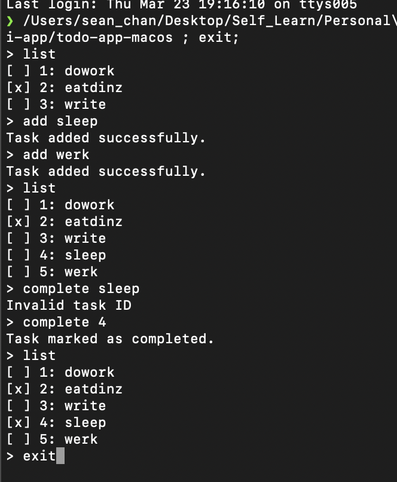

# Simple CLI Todo App

## oiu

A simple command-line todo app written in Golang. The app allows you to add tasks, list tasks, and mark tasks as completed using a JSON file as storage.

## Prerequisites

- Golang installed on your machine.

## Getting Started

To get started, clone or download the source code to your local machine.

1. Open your terminal and navigate to the project directory.
2. Run the application using `go run main.go`

### Usage

The application waits indefinitely for user input and processes commands as they are entered. The available commands are:

1. Add a new task:

`add <task_name>`
2. List all tasks:

`list`
3. Mark a task as completed:

`complete <task_id>`

4. Exit the application:

exit